

# Exploring Wazuh

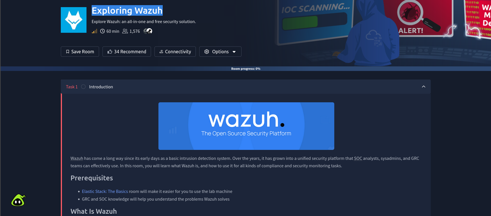

Wazuh originally started as a host-based intrusion detection system (HIDS), but it has evolved into a broader unified security platform. Today, Wazuh brings together capabilities such as:

* **Endpoint Detection and Response (EDR)** — monitors endpoints for suspicious behavior.
* **Security Information and Event Management (SIEM)** — collects, analyzes, and correlates security events.
* **Vulnerability Detection** — identifies vulnerable software and packages on monitored systems.
* **File Integrity Monitoring (FIM)** — detects unauthorized changes to important files.
* **Security Configuration Assessment (SCA)** — checks systems against security configuration standards.
* **Cloud Security Monitoring** — monitors activity and configuration in cloud environments.
* **Compliance Monitoring** — helps organizations assess systems against regulatory/security frameworks.
* **Dashboards and Visualization** — turns large amounts of security data into understandable alerts, graphs, and reports.

---

## Task 2: Launching the Wazuh Server

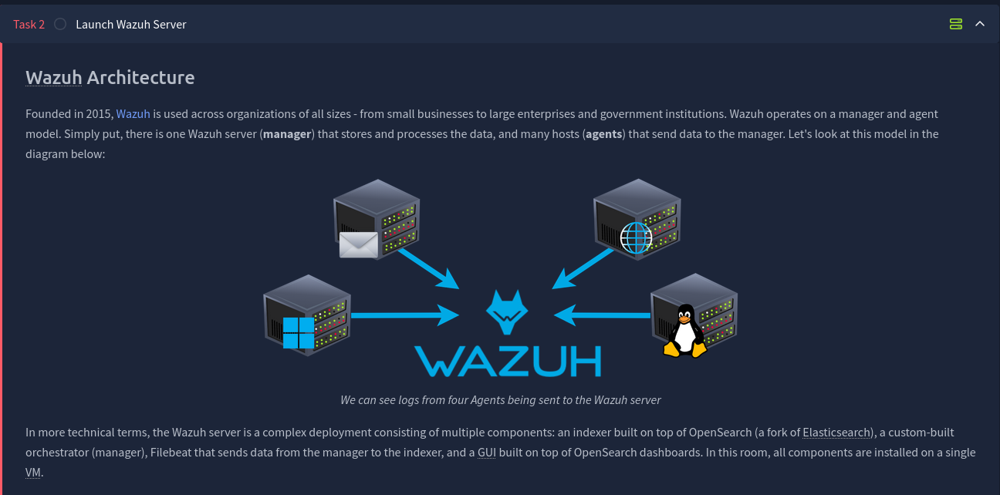

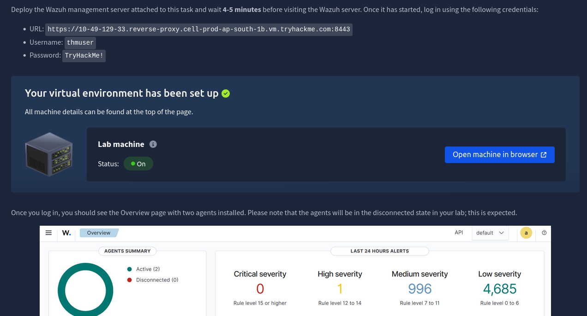

**Answer:** No answer needed.

---

## Task 3: Installing Wazuh Agents

Agents monitor the events that take place on the device, such as authentication and OS activities; they also audit the device for misconfigurations and much more. Let's analyze the two existing agents: one Linux and one Windows device. From the Overview page, click on the "Disconnected" keyword in the Agents Summary panel:

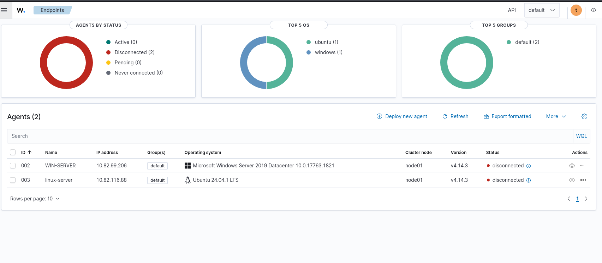

### Agent Groups

If you were to deploy an agent, you would need to specify the IP address of your Wazuh server, the agent name (typically the same as the hostname), and the group. Agents can be organized into groups, each of which can contain specific audit policies and logging settings. For example, you could have a group named `CORP` for corporate servers and desktops, and another group for personal laptops.
**Question:** What is the status of the agents managed by this Wazuh?
**Answer:** Disconnected.
**Question:** Click on the Windows agent. What is the CPU field value?
**Answer:** AMD EPYC 7571

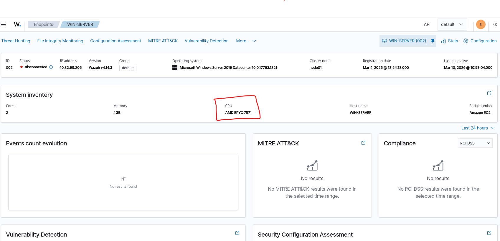

---

## Task 4: Configuration Assessment

Once the agent is installed, Wazuh runs lots of security checks and collects a ton of information about the host. One of the most useful categories for IT is the IT Hygiene checks. Select the WIN-SERVER agent, click **More**, and open the **IT Hygiene** section. Once you are there, you will see multiple tabs, such as:

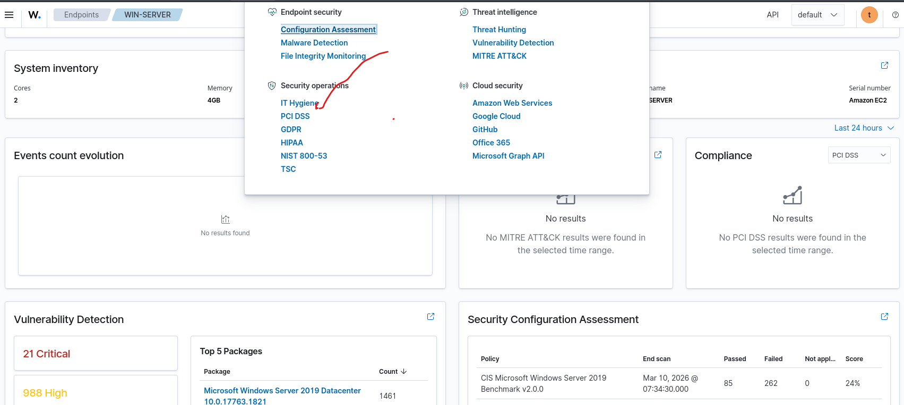

* **System:** Hardware, hostname, network interfaces, and OS version.
* **Software:** Installed programs, OS patches, and even browser extensions.
* **Network:** Listening ports (vital for exposure management).
* **Identity:** Local users present on the device, including their privileges.

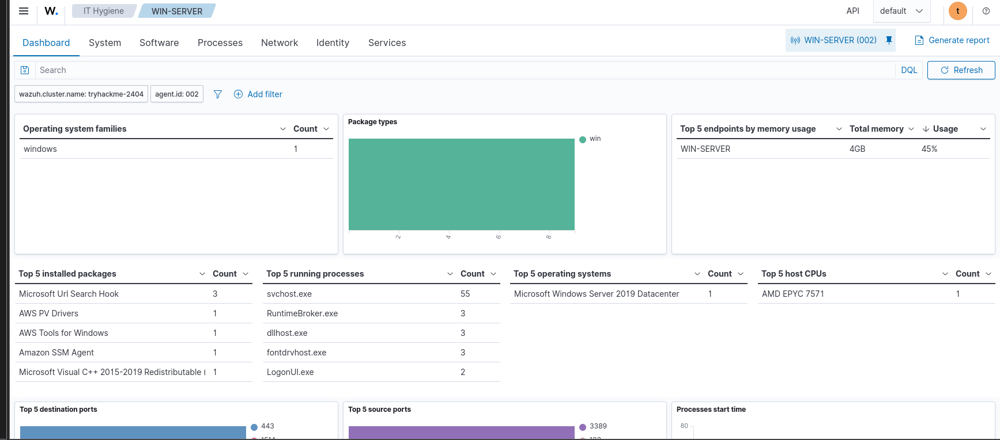

### Wazuh and CIS Benchmarks

Wazuh is capable of auditing and monitoring an agent's configuration against CIS benchmarks or custom checklists. As shown in the image below, when the Wazuh agent is installed on the Windows machine, it runs 347 CIS security checks (typically PowerShell commands) and verifies the results. You can use this to audit your devices for misconfigurations and prepare them for security audits. Select the WIN-SERVER agent and open its **Configuration Assessment** panel to get started:

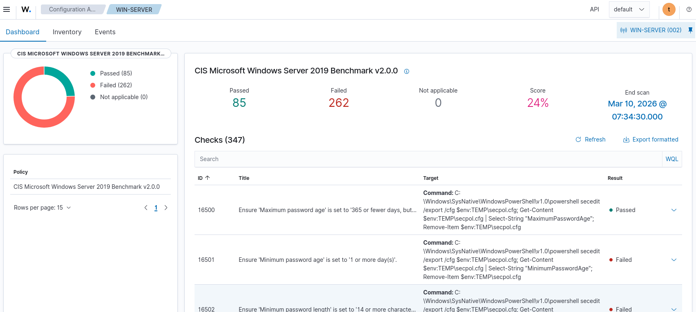
**Question:** Open the Windows agent and navigate to its IT Hygiene tab. What custom text editor is installed there (Software > Packages)?
**Answer:** Notepad++

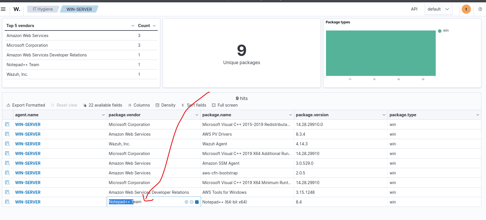
**Question:** Now open the Linux agent and its Configuration Assessment tab. What is the CIS Benchmark score of the Linux agent (e.g., 65%)?
**Answer:** 46%

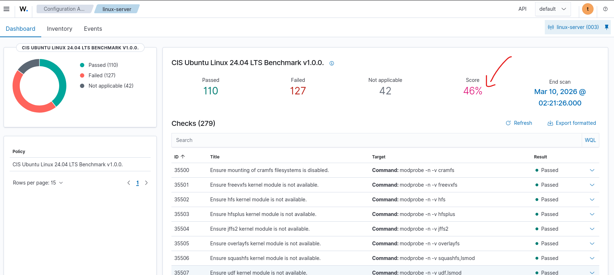

---

## Task 5: Vulnerability Detection

Wazuh's Vulnerability Detection module is another powerful tool that can be used to periodically scan an agent for vulnerable applications. However, out of the box, it is arguably sensitive. Take, for example, the fresh Ubuntu server named `linux-server`. During the latest scan, Wazuh reported 1,293 vulnerabilities, 3 of which are critical (you might see even more in your lab). While the information is technically correct, only a few of the reported vulnerabilities can be exploited, and IT administrators would need to decide what to patch on their own.

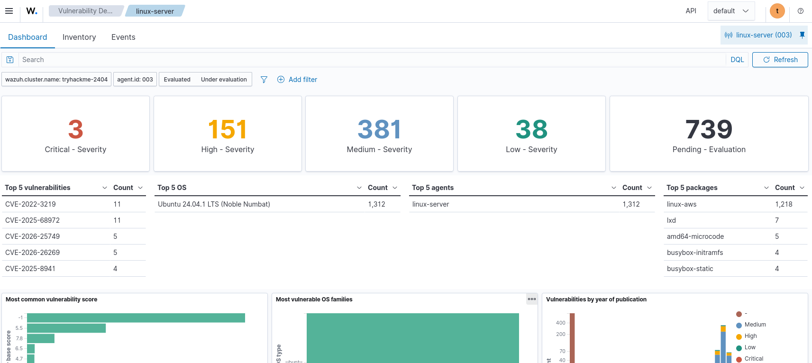

Wazuh reevaluates vulnerabilities from time to time and every time a new package is installed. You can sort and filter vulnerabilities based on various factors such as timestamp, CVE number, package, or description. For example, to filter for Linux kernel vulnerabilities, you should select the `linux-server` agent, go to the **Inventory** sub-tab, and filter for `package.name IS linux-aws`:

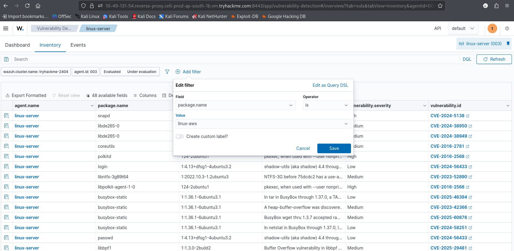
**Question:** What is the latest Notepad++ vulnerability found on the Windows agent? Provide the most recent CVE number (e.g., CVE-2026-23569).
**Answer:** CVE-2026-25926
  
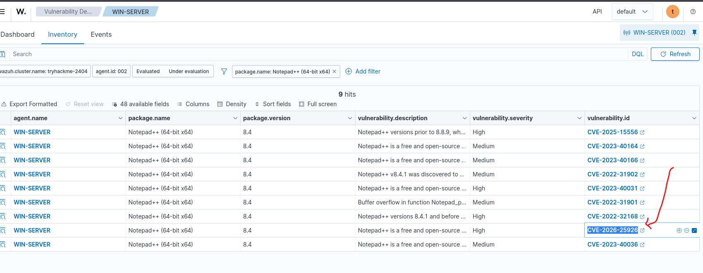
**Question:** What is the earliest critical vulnerability found on the Linux agent? Provide the oldest CVE number (e.g., CVE-2015-3719).
**Answer:** CVE-2021-3773

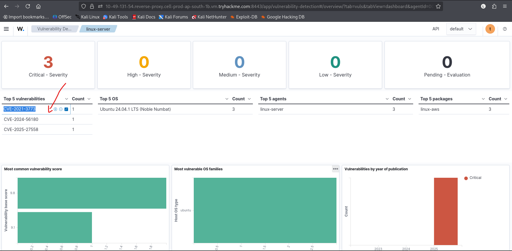

---

## Task 6: Logging and Reporting

### Logging with Wazuh

The core Wazuh capability is to collect and parse security logs from the agents. With some tweaks, Wazuh becomes a powerful SIEM, similar to Elasticsearch and Kibana. Let's start by checking the authentication logs from the Linux server. First, open the top-left menu > **Explore** dropdown > **Discover** page. This is the panel where all raw logs can be viewed, including the configuration assessment and vulnerability detection results:

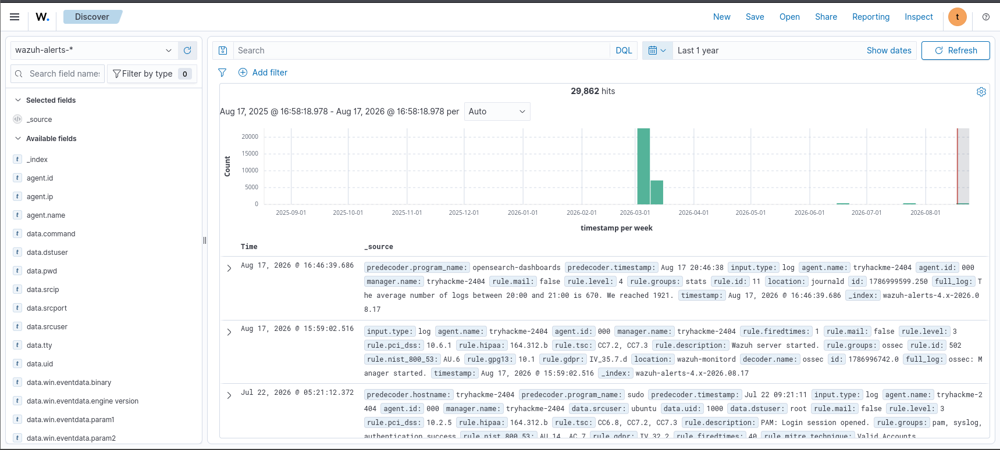

Next, let's explore the Discover menu:

* **Index pattern selector and field search:** Useful to learn which fields are present in the events.
* **Search query input and time selector:** To view logins, please apply these settings:
  * **Search query:** `decoder.name: sshd`
  * **Time range:** `Last 5 years`
* **The actual events:** You can expand each event by clicking the toggle near the timestamp.

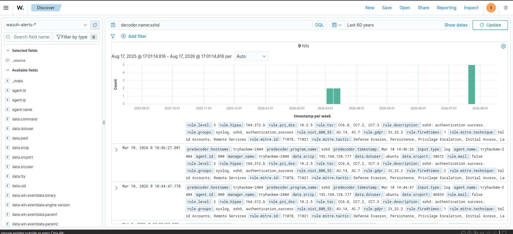

### Logs vs. Rules vs. Alerts

In Wazuh, there is no concept of traditional SIEM logs. Instead, you define what logs will become alerts using Wazuh rules, and all non-matching events will be discarded. For example, the two SSH events you saw earlier were Wazuh alerts, generated by rule ID 5715. Wazuh has hundreds of prebuilt rules for different OS data sources, each having a level from 1 to 15, where 15 is the most critical alert possible. We will explore the rules in the next room.

### Dashboards and Reports

While Wazuh has tons of prebuilt dashboards for routine tasks, you might want to create a custom one at some point. To begin with, you can open the top-left menu > **Explore** > **Visualize** > **Create Visualization**. From there, select **Pie**, choose the `wazuh-alerts-*` source, add the **Split slices** bucket, and aggregate by `agent.name`, as shown in the image below. Then, click **Update**. Don't forget to set the global time range to **Last 5 years**.

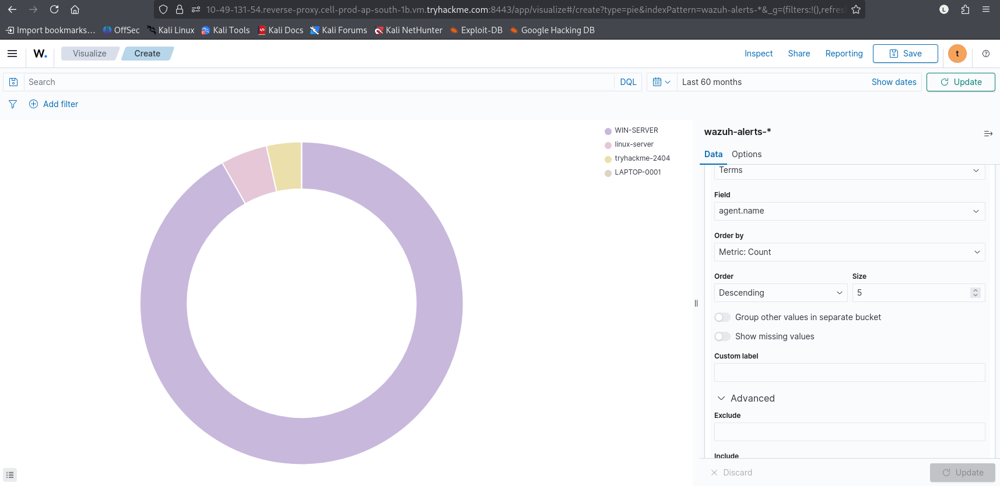

You can combine multiple visualization panels into a single dashboard. You can explore the prepared Demo Dashboard by navigating to the top-left menu > **Explore** > **Dashboards** menu. The menu might be overwhelming at first, but overall, Wazuh has very powerful reporting capabilities.
**Question:** Navigate to Discover and search for Defender alerts for the last 5 years using the query `data.win.system.eventID: 1116`. What is the threat name of the detected malware?
**Answer:** Trojan:Win32/CobaltStrike.PU!MTB

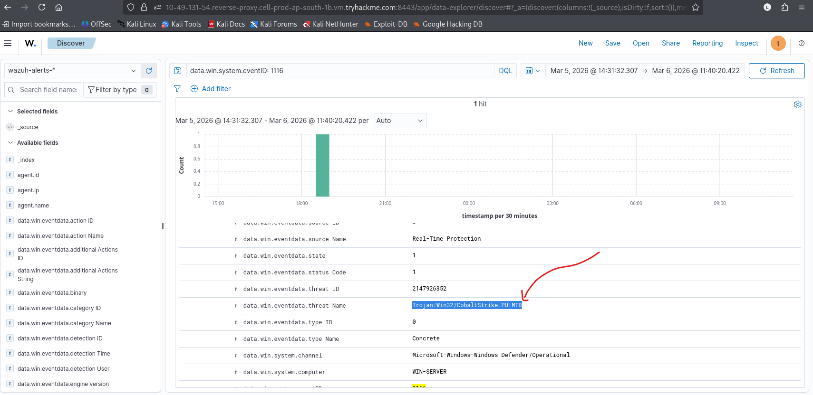
**Question:** Navigate to the Demo Dashboard. How many total events are shown?
**Answer:** 5,495

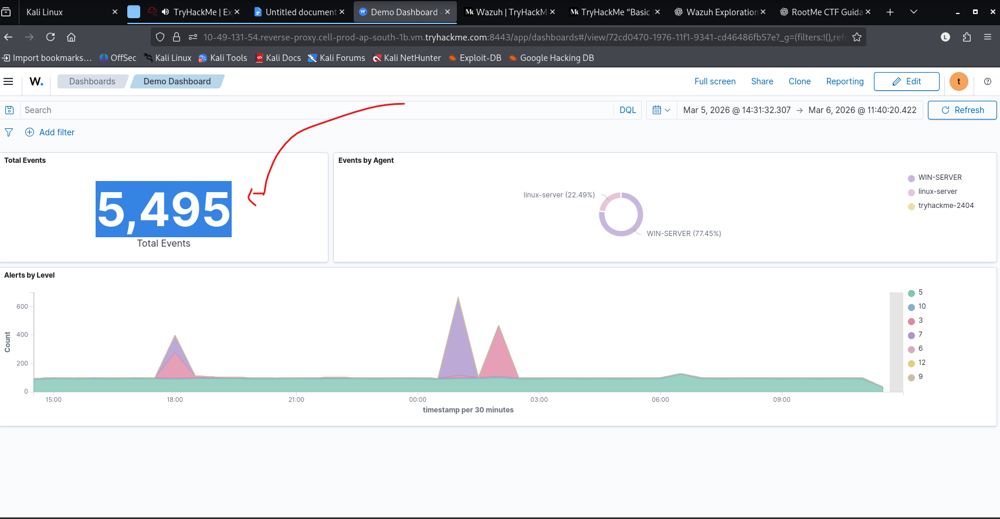

---

## Task 7: Custom Rules and Log Collection

### Agent Configuration

Wazuh collects basic system logs by default, but that's usually not enough for mature SOC teams. To collect custom logs, you need to specify the requirements in the **Groups** menu, and they will automatically propagate to all active agents. We have already added two custom settings to the default group to collect `/var/log/auth.log` from the Linux agent and Microsoft Defender event logs from Windows agents. Check it out by going to **Agents management** > **Groups** and clicking the pencil icon:

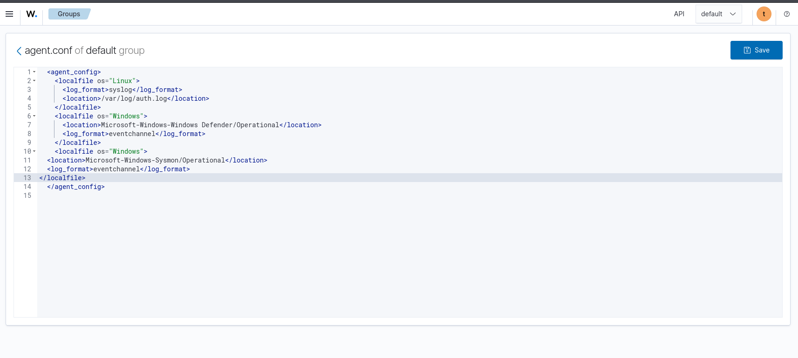

### Wazuh Decoders

The agent configuration defines what to collect from the agents. Next, you need to instruct Wazuh on how to process (parse) the incoming raw data, as every source sends the events in its own unique format. The parsing instructions are called decoders, and there are hundreds of default decoders you can find in the **Server management** > **Decoders** menu. We won't explore the decoders in this room, but here is an example for Sysmon event code 1 for your reference:

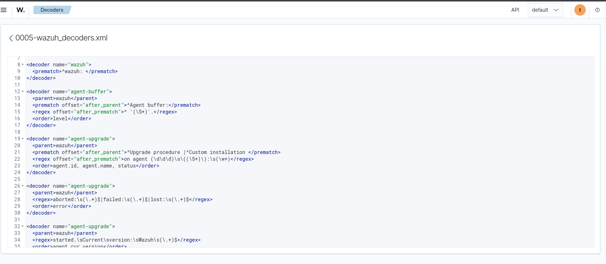

### Wazuh Rules

Next, the parsed logs must become alerts to be visible in the Wazuh dashboard. To create alerts, you need to create Wazuh rules. For example, in order to monitor PowerShell execution on your agents, you will need two rules: the first to alert on all Sysmon event code 1 logs (`level="0"` means informational severity), and the second to alert on any PowerShell execution (`level="12"` means a high-importance event). You can see the existing rules in the **Server management** > **Rules** menu.

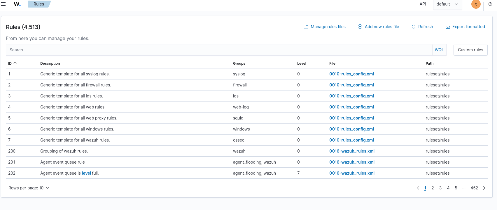

### Alert Notifications

Finally, you can configure notifications if some of your rules are triggered. In the simplest case, you can write a query `rule.level >= 12`, create an alert from it in **Explore** > **Alerting** menu, and then set up a notification channel (e.g., Slack message or email). You will receive a notification every time your query matches new events.

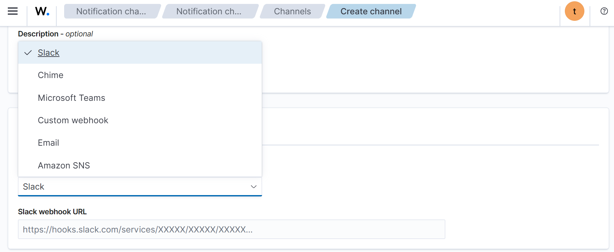
**Question:** How do you call the Wazuh element that extracts fields from raw logs?
**Answer:** Decoder
**Question:** What Wazuh alert is more critical, the one with rule.level set to 10 or 15?
**Answer:** 15

---

## Task 9: Unique Wazuh Features

### Explored Features

Let's summarize the features we have explored. For IT and GRC, these include:

* **Vulnerability Detection** to track software vulnerabilities on the agents.
* **Configuration Assessment** to track security misconfigurations on the agents.
* **IT Hygiene** to view agent details and list installed apps and browser extensions.

There are also several great features to make Wazuh a powerful **SIEM**, such as:

* **Decoders and Rules** to ingest and monitor system and application logs.
* **Discover and Dashboards** to search and visualize the ingested logs.

Now, let's explore some lesser-known Wazuh features that you should definitely test yourself!

### Wazuh Active Response

In response to received events, Wazuh can send a response command ([Active Response](https://documentation.wazuh.com/current/user-manual/capabilities/active-response/index.html)) to the agent: run a script, delete a file, block a network connection, and more. Just keep in mind that the response is executed with a delay (up to a few minutes), and therefore cannot fully replace dedicated endpoint security features like real-time process kill or malware quarantine. Still, Active Response can be used as an RMM/MDM for mass software deployment or to support the existing antivirus/EDR solution.

### File Integrity Monitoring

Many government regulations require organizations to monitor critical files for unauthorized changes, including OS configurations, application settings, and user profiles. Beyond compliance, companies may also need to enforce strict access controls on sensitive files such as SSH keys. Wazuh addresses both needs through its [File Integrity Monitoring (FIM)](https://documentation.wazuh.com/current/user-manual/capabilities/file-integrity/index.html) module, which logs every modification to selected files and directories (as well as registry keys on Windows). Explore it yourself under **Endpoint Security** > **File Integrity Monitoring**!

### FIM and Malware Detection

Wazuh goes beyond basic file monitoring with two built-in malware detection features: YARA and VirusTotal integration. Whenever a monitored file is created or modified, Wazuh automatically scans it using your YARA rules and checks its hash against VirusTotal. A match triggers an alert and, optionally, an Active Response action to contain the threat. Note that you must bring your own YARA rules and VirusTotal key to make the features work.

Wazuh is a universal security solution that can fit different needs and be used by different teams. Try installing Wazuh in your home lab—it's highly educational! Also, if you want to play with Wazuh without ingesting real logs, try ingesting the demo data via **Indexer management** > **Sample Data**. Just note that some datasets may require an internet connection to be downloaded. Hope you enjoyed the room!

